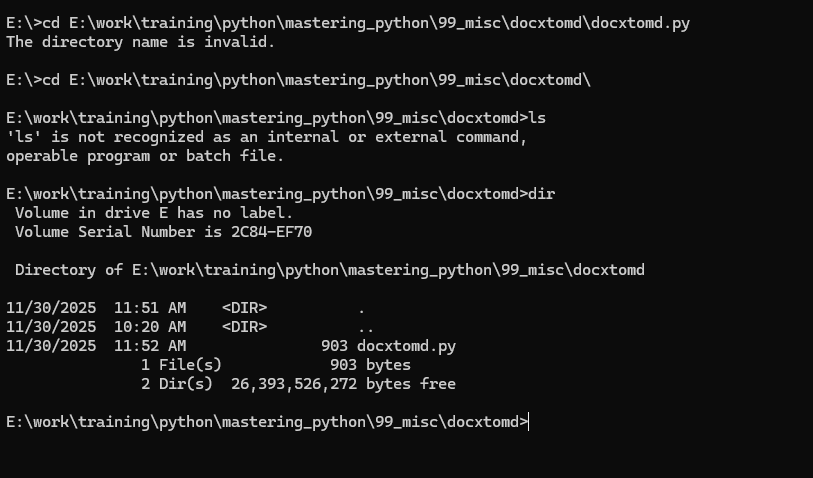
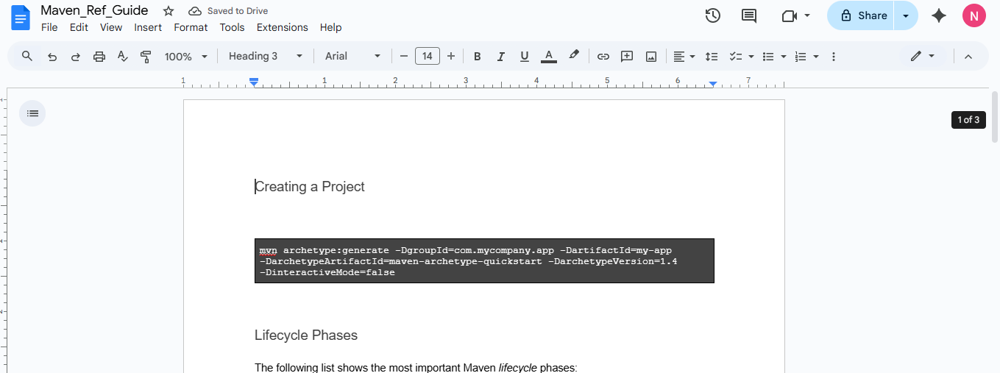

# Kubernetes Course End Project

[**Kubernetes Course End Project 1**](#kubernetes-course-end-project)

[**Problem Statement and Motivation
2**](#problem-statement-and-motivation)

> [Real-time scenario: 2](#real-time-scenario)
>
> [Assumptions: 2](#assumptions)
>
> [List of Project tasks: 2](#list-of-project-tasks)
>
> [Screenshots 3](#screenshots)
>
> [Conclusion 4](#conclusion)

#  

# Problem Statement and Motivation 

## Real-time scenario: 

Karen is a DevOps engineer at a tech startup. Her team has developed a
new application using MySQL. Now, it is her task to deploy that
application. The company plans to utilize Kubernetes for its robust
container orchestration capabilities. Karen must create a Kubernetes
dashboard with specific configurations, user roles, storage, service
verification, and data management.

## Assumptions:

1.  No Cloud deployment is needed.

2.  Simplilearn lab environment will be used

3.  No CI/CD Pipeline is needed

4.  I will be using WordPress Application with MySQL

5.  Containers are already available in Docker Hub

6.  I will be using my git repo to store yaml files and documentation

## List of Project tasks:

-------------------------------------------------------------------------------
| **S. No**  | **Task Description**                   | **Status**            |
-------------------------------------------------------------------------------
| 1          | Set up the cluster in Simplilearn lab  | In Progress/          |
|            | environment with 1 master and 3 worker | Completed / Not       |
|            | nodes                                  | started               |
-------------------------------------------------------------------------------
| 2          | Write/Prepare required yaml files      | In Progress/          |
|            | (deployment/service of front end,      | Completed / Not       |
|            | deployment/service of backend,         | started               |
|            | configmaps, secrets)                   |                       |
-------------------------------------------------------------------------------
| 3          | Setup git repo and push all the yaml   | In Progress/          |
|            | files from step 2                      | Completed / Not       |
|            |                                        | started               |
-------------------------------------------------------------------------------
| 4          | Create a new user, new namespace and   | In Progress/          |
| (optional) | apply Role/RoleBinding for the         | Completed / Not       |
|            | user/namespace                         | started               |
-------------------------------------------------------------------------------
| 5          | Create a new context and switch to     |                       |
| (optional) | that context for Step 6                |                       |
-------------------------------------------------------------------------------
| 6          | Deploy yaml files one by one (for      | In Progress/          |
|            | deploy, service, configmaps, secrets,  | Completed / Not       |
|            | etc)                                   | started               |
-------------------------------------------------------------------------------
| 7          | Fix yaml files indentation or syntax   | In Progress/          |
|            | errors; Deploy again                   | Completed / Not       |
|            |                                        | started               |
-------------------------------------------------------------------------------
| 8          | Verification of K8S objects such as    | In Progress/          |
|            | deployment, configmaps, secrets, etc;  | Completed / Not       |
|            |                                        | started               |
|            | Troubleshoot any issues and fix by     |                       |
|            | checking status of the K8S objects     |                       |
|            | using kubectl; log verification.       |                       |
-------------------------------------------------------------------------------
| 9          | Launch the Ubuntu Desktop on the Lab   | In Progress/          |
|            | master node and then verify the        | Completed / Not       |
|            | application (Wordpress)                | started               |
-------------------------------------------------------------------------------
| 10         | Validate Application → DB connection   | In Progress/          |
|            | and able to setup Wordpress; Login     | Completed / Not       |
|            | Again to Wordpress                     | started               |
-------------------------------------------------------------------------------
| 11         | Troubleshoot for any issues if Step 9  | In Progress/          |
|            | and 10 are not successful              | Completed / Not       |
|            |                                        | started               |
-------------------------------------------------------------------------------
| 12         | Deploy K8S Dashboard using the         | In Progress/          |
|            | documentation we have                  | Completed / Not       |
|            |                                        | started               |
-------------------------------------------------------------------------------
| 13         | Update your GitHub repo and push your  | In Progress/          |
|            | changes made to yaml files             | Completed / Not       |
|            |                                        | started               |
-------------------------------------------------------------------------------
| 14         | Update this documentation for task     | In Progress/          |
|            | status;                                | Completed / Not       |
|            |                                        | started               |
|            | Update this documentation with         |                       |
|            | screenshots of your Wordpress app, K8S |                       |
|            | dashboard, Kubectl commands output     |                       |
|            | (e.g. kubectl get pods/deploy/service, |                       |
|            | etc)                                   |                       |
-------------------------------------------------------------------------------
| 15         | Submit the project documentation (this | In Progress/          |
|            | documentation) to Simplilearn for      | Completed / Not       |
|            | verification                           | started               |
-------------------------------------------------------------------------------

## Screenshots

{width="6.5in"
height="3.821527777777778in"}

{width="6.5in" height="2.425in"}

## Conclusion

Followed the lesson references and lab documentation to implement the
above given problem statement and applied all my K8S learnings.
